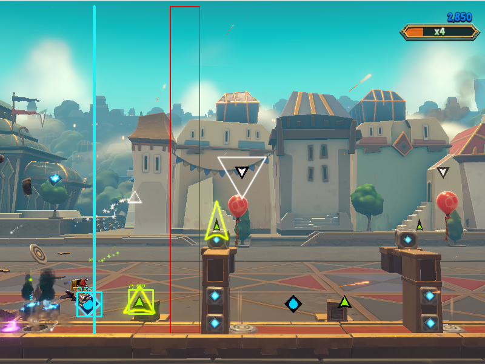

# Hextech-Bot

Um bot que joga o Hextech Mayhem utilizando [template matching](https://docs.opencv.org/4.x/d4/dc6/tutorial_py_template_matching.html) para encontrar os comandos na tela e executa após um tempo calculado pela velocidade dos comandos na tela.

Foi testado até agora nas fases 1-1, 1-2 e 1-3.

Após finalizar, a lista de comandos executada é salva em um CSV.

**TODO:**
- [x] completar as fases 1 com 100%
- [ ] testar em todos as outras fases
- [ ] utilizar a lista de comandos como input para o bot